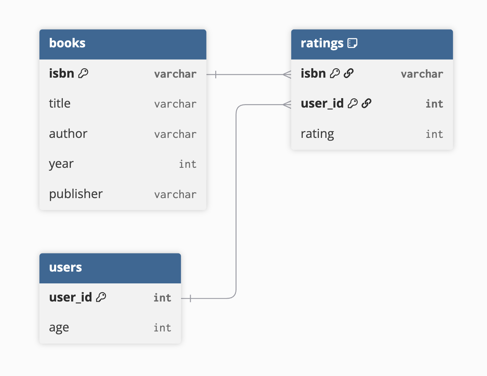

# One More Chapter

This repository contains a small ingestion / exploration starter for the Book-Crossing dataset from the Book-Crossing community. The goal is to prepare the dataset for recommendation, analysis, and modeling, while keeping the pipeline simple and reproducible.

## Understanding the Dataset

Source: [Book-Crossing dataset on Kaggle](https://www.kaggle.com/datasets/somnambwl/bookcrossing-dataset?select=Books.csv)

| Entity | Count | Notes |
|---|---|---|
| Users | 278,858 | anonymized with demographic fields |
| Books | 271,379 | titles in the dataset |
| Ratings | 1,149,780 | explicit and implicit ratings |

Note: Since this project currently focuses on the core user-book-rating relationships and book metadata, it does not include the following optional dataset features:

- anonymized user location fields
- book image URLs for small/medium/large cover images

## References and Acknowledgements

The [Book-Crossing dataset on Kaggle](https://www.kaggle.com/datasets/somnambwl/bookcrossing-dataset?select=Books.csv) is collected by Cai-Nicolas Ziegler with kind permission from Ron Hornbaker, CTO of Humankind Systems.

It is stated that the dataset is freely available for research use when acknowledged with the following reference:

> Improving Recommendation Lists Through Topic Diversification,
Cai-Nicolas Ziegler, Sean M. McNee, Joseph A. Konstan, Georg Lausen; Proceedings of the 14th International World Wide Web Conference (WWW '05), May 10-14, 2005, Chiba, Japan. 