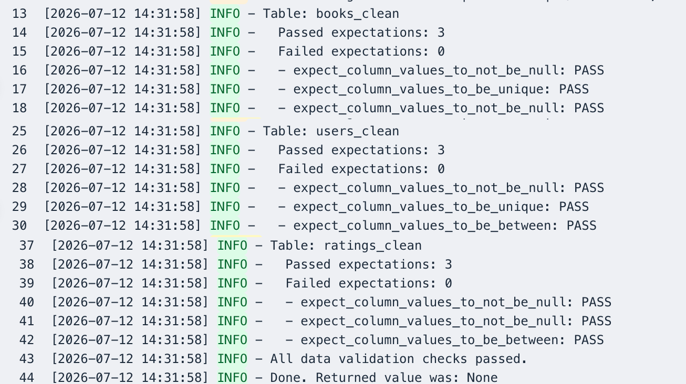
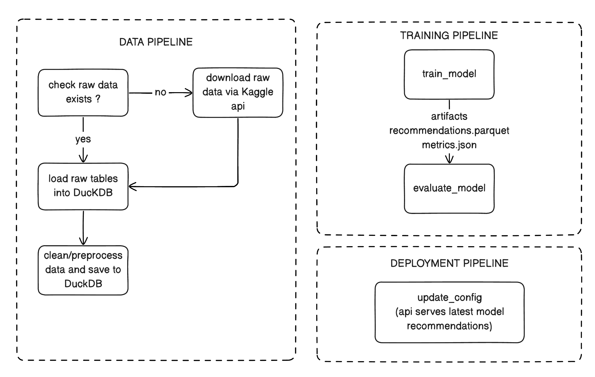
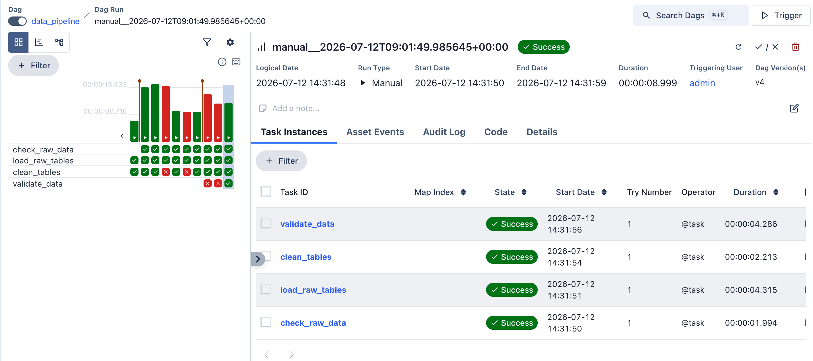

# One More Chapter

This is a mini project using the Book-Crossing Dataset to create a minimal data, training and deployment pipeline. 

Overview of technologies used: **Pandas, DuckDB, SQL, Airflow, FastAPI**

#### Go to:
- [Understanding the Dataset](#understanding-the-dataset)
- [Data exploration](#data-exploration)
- [Storage (DuckDB and intermediate parquet files)](#storage-duckdb-and-intermediate-parquet-files)
- [Great expectations](#great-expectations)
- [FastAPI endpoint](#fastapi-endpoint)
- [Airflow Pipelines](#airflow-pipelines)
- [Note to self](#note-to-self)
- [References and Acknowledgements](#references-and-acknowledgements)

## Understanding the Dataset

Source: [Book-Crossing dataset on Kaggle](https://www.kaggle.com/datasets/syedjaferk/book-crossing-dataset?select=BX-Books.csv)

BookCrossing is a platform where books are registered and then passed on from person to person- sometimes after the user gives it a rating. Here, we will deal with 3 tables: Books, Users and Ratings and try to recommend books , using a simple popularity algorithm.

Note: This is real-world data and comes with missing, mismatched and wrong data.

## Data exploration
- `notebooks/exploration.ipynb` verifies raw data quality and schema issues before preprocessing
- Key observations: 
    - Book metadata needs cleanup: missing authors/publishers, bad years
    - Users require age/country normalization
    - Ratings are sparse and long-tailed, with many implicit zeros

## Storage (DuckDB and intermediate parquet files)

- Raw CSVs are loaded from `data/raw/` into DuckDB at `database/books.duckdb` via `src/data/ingest.py`
- Clean tables are built with `src/data/preprocess.py`:
  - `books_clean`
  - `users_clean`
  - `ratings_clean`
- Cleaned tables are exported as Parquet files into `data/processed/` for backup/ inter team usage.

Resources:
[DuckDB Python installation](https://duckdb.org/install/?platform=macos&environment=python)

## Great expectations

The cleaned datasets are validated for basic data quality (missing values, uniqueness, and valid ranges) before the pipeline continues.

Resources:
[Great expectations learning documentation](https://docs.greatexpectations.io/docs/reference/learn/)

## FastAPI endpoint

Serve recommended books on this endpoint:
`$/recommend/popular`

Note: Start FastAPI app by running this command:
` uvicorn src.api.app:app --reload ` and then going to `http://127.0.0.1:8000/recommend/popular` for recommendations.

## Airflow Pipelines

1. **Data processing pipeline** : ensures raw data exists, ingests raw data and processed/cleaned data into DuckDB.

2. **Training Pipeline** : uses processed/cleaned data from DuckDB to train and evaluate(basic) a model. Produces `artifacts/../recommendations.parquet` that is used by FastAPI.

3. **Deployment Pipeline** : updates the model served by the endpoint in production.

Note: just use `chmod +x start_airflow.sh` and `./start_airflow.sh` to set the airflow hom, dag root and start sirflow standalone. Then go to `http://localhost:8080` and enter username and pw from `airflow/simple_auth_manager_passwords.json.generated`
- You can set `load_examples = False` in `airflow/airflow.cfg` to show only your dags.

## Note to self

Ideas to make the next project stronger:

- Choose a dataset with richer features so I can perform deeper EDA, discover meaningful correlations, and engineer better features.
- Spend more time defining the ML problem before writing code (success metrics, assumptions, evaluation strategy, and expected users).
- Separate the project into clear data, feature, training, evaluation, serving, and monitoring layers from the beginning.
- Add automated data validation (Great Expectations) before preprocessing instead of relying on manual notebook checks.
- Build reproducible experiments using MLflow with proper parameter, metric, and artifact tracking.
- Create a feature store (Feast) to separate feature engineering from model training and ensure training-serving consistency.
- Add automated tests (unit, integration, and smoke tests) for pipelines and API endpoints.
- Add monitoring for data quality, model performance, and API latency to simulate a production system.
- Document architecture decisions and trade-offs as the project evolves rather than only documenting the final implementation.

## References and Acknowledgements

The [Book-Crossing dataset on Kaggle](https://www.kaggle.com/datasets/somnambwl/bookcrossing-dataset?select=Books.csv) is collected by Cai-Nicolas Ziegler with kind permission from Ron Hornbaker, CTO of Humankind Systems.

It is stated that the dataset is freely available for research use when acknowledged with the following reference:

> Improving Recommendation Lists Through Topic Diversification,
Cai-Nicolas Ziegler, Sean M. McNee, Joseph A. Konstan, Georg Lausen; Proceedings of the 14th International World Wide Web Conference (WWW '05), May 10-14, 2005, Chiba, Japan. 