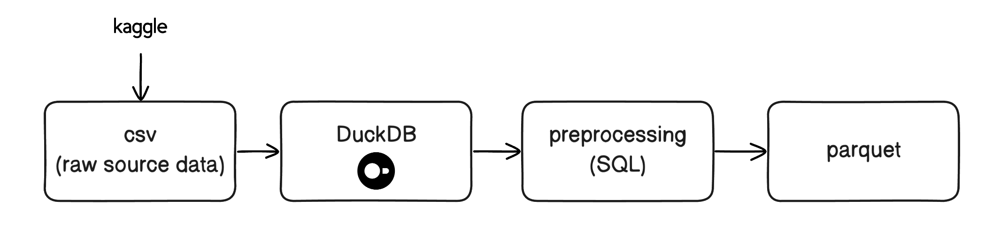

# One More Chapter

This repository contains a small ingestion / exploration starter for the Book-Crossing dataset from the Book-Crossing community. The goal is to prepare the dataset for recommendation, analysis, and modeling, while keeping the pipeline simple and reproducible.

## Understanding the Dataset

Source: [Book-Crossing dataset on Kaggle](https://www.kaggle.com/datasets/syedjaferk/book-crossing-dataset?select=BX-Books.csv)

## Data exploration key observations
- `notebooks/exploration.ipynb` verifies raw data quality and schema issues before preprocessing
- Key observations: 
    - Book metadata needs cleanup: missing authors/publishers, bad years
    - Users require age/country normalization
    - Ratings are sparse and long-tailed, with many implicit zeros

## Storage (DuckDB and intermediate parquet files)

- Raw CSVs are loaded from `data/raw/` into DuckDB at `database/books.duckdb` via `src/data/ingest.py`
- Clean tables are built with `src/data/preprocess.py`:
  - `books_clean`
  - `users_clean`
  - `ratings_clean`
- Cleaned tables are exported as Parquet files into `data/processed/`

Resources:
[DuckDB Python installation](https://duckdb.org/install/?platform=macos&environment=python)

## References and Acknowledgements

The [Book-Crossing dataset on Kaggle](https://www.kaggle.com/datasets/somnambwl/bookcrossing-dataset?select=Books.csv) is collected by Cai-Nicolas Ziegler with kind permission from Ron Hornbaker, CTO of Humankind Systems.

It is stated that the dataset is freely available for research use when acknowledged with the following reference:

> Improving Recommendation Lists Through Topic Diversification,
Cai-Nicolas Ziegler, Sean M. McNee, Joseph A. Konstan, Georg Lausen; Proceedings of the 14th International World Wide Web Conference (WWW '05), May 10-14, 2005, Chiba, Japan. 